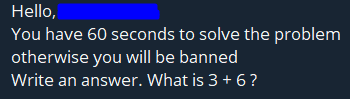

# Captchot

This is a **simple** captcha bot for your Telegram group. *Captchot* provides basic protection against bots, userbots, flooders and other.

## How it works?

It uses a simple task that is randomly generated to screen out users. 

If a user fails to solve the task within a certain time, the bot bans that user.

Remember that in order for the bot to work in your Telegram group, it must have administrator rights.

## I want to use Catchot!

Catchot can serve as the basis for your implementation of any captcha bot.

To start using the bot, just clone this repository via:

    git clone https://github.com/Blthrst/captchot

---

Then you need to install dependencies:

    yarn install

Or:

    npm install

---

At last you need to rename `config.example.yaml` to `config.yaml` and set up your configuration. You can learn how to get bot and bot token [here](https://core.telegram.org/bots#how-do-i-create-a-bot)

After that you can use scripts from `package.json` and enjoy Captchot, for example:

    yarn run start

### Integrations:

- #### grammY
- #### random-js

---

### *Feel free to leave issues!*